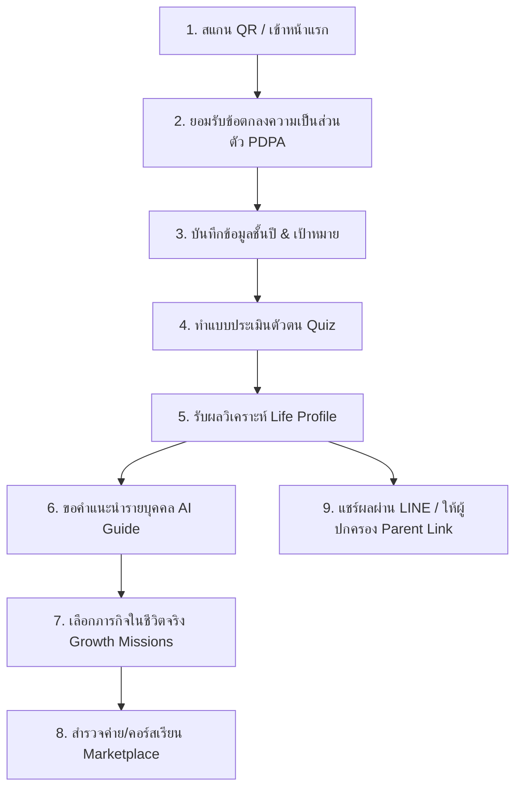

# คู่มือการใช้งาน LifeMap (User & Facilitator Manual)
**ระบบหนังสือเดินทางชีวิตและสำรวจอนาคตสำหรับนักเรียนมัธยมปลาย (ม.4 - ม.6)**

---

## 1. ข้อมูลภาพรวมผลิตภัณฑ์ (Product Overview)

**LifeMap Future Profile (เวอร์ชัน 2)** คือเครื่องมือในการสะท้อนตัวตนและแนะแนวทางชีวิต (Reflection & Guidance Tool) ที่ได้รับการออกแบบขึ้นเพื่อช่วยให้นักเรียนระดับชั้นมัธยมศึกษาตอนปลาย (ม.4 - ม.6) ค้นพบจุดแข็ง สไตล์การเรียนรู้ และเส้นทางอาชีพที่สอดคล้องกับศักยภาพของตนเองผ่านการใช้งานในรูปแบบ **Mobile Portrait-First** (เน้นการใช้งานมือถือแนวตั้งด้วยมือเดียวอย่างสะดวกสบาย)

> [!IMPORTANT]
> **หลักการสำคัญของ LifeMap:**  
> LifeMap **ไม่ใช่**แบบทดสอบเพื่อตัดสินชีวิตของนักเรียน **ไม่ใช่**เครื่องมือวินิจฉัยทางการแพทย์หรือจิตวิทยา และ**ไม่มี**การรับประกันว่านักเรียนต้องสอบติดคณะใดคณะหนึ่งโดยเฉพาะ แต่เป็นเครื่องมือช่วยให้นักเรียนเห็นว่า **"ตอนนี้ตนเองมีจุดแข็งอะไรบ้าง มีทางเลือกใดที่น่าสนใจ และควรลงมือทำอะไรต่อไปในชีวิตจริง"**

### โครงสร้างระบบ (System Architecture)
* **Future Passport (หน้าแรก):** แผงควบคุม (Dashboard) เพื่อติดตามความก้าวหน้าการเรียนรู้ของตัวเอง
* **Consent / PDPA:** ระบบเก็บความยินยอมในการใช้ข้อมูลแบบโปร่งใส โดยเก็บข้อมูลไว้ที่เครื่องของผู้ใช้ (Local-First) เพื่อความปลอดภัยสูงสุด
* **Quiz Engine:** แบบประเมินคุณลักษณะและสไตล์การเรียนรู้ที่ตอบสนุก เข้าใจง่าย ไม่มีความกดดัน
* **Life Profile:** ผลวิเคราะห์ที่สะท้อน Archetype (กลุ่มลักษณะเฉพาะตัว), อาชีพที่เหมาะสม และคำแนะนำเชิงปฏิบัติการ
* **AI Guide:** ผู้ช่วยส่วนตัวเสมือนจริงที่ช่วยตอบคำถามและแนะแนวทางก้าวต่อไปของชีวิตอย่างปลอดภัย
* **Growth Missions:** ภารกิจท้าทายตนเองระยะสั้น (เช่น 7 วัน) เพื่อเปลี่ยนข้อเสนอแนะในหน้าจอคอมพิวเตอร์ให้เกิดการลงมือปฏิบัติจริง
* **Opportunities Marketplace:** แหล่งรวมข่าวสาร ค่ายวิชาการ ทุนการศึกษา และคอร์สเรียนสอดคล้องกับโปรไฟล์ของนักเรียน
* **Parent Link & LINE Share:** ฟังก์ชันส่งต่อผลลัพธ์ผ่าน LINE ให้ผู้ปกครอง เพื่อน หรือครู เพื่อใช้เป็นจุดเริ่มต้นในการปรึกษาหารืออย่างเปิดใจ

---

## 2. เส้นทางการใช้งานของนักเรียน (Core Student Journey)

การเดินทางในแอป LifeMap ได้รับการออกแบบให้สอดคล้องกับการวางแผนอนาคตอย่างเป็นขั้นเป็นตอน:

### ขั้นตอนการเดินทาง (Step-by-Step)
1. **Welcome & Introduction:** ทำความเข้าใจทัศนคติของแอป โดยตั้งเป้าหมายเพื่อ "สำรวจตนเองอย่างผ่อนคลาย"
2. **Consent (PDPA):** นักเรียนสามารถตัดสินใจเปิด/ปิดการเปิดเผยข้อมูลส่วนบุคคลได้อย่างอิสระ มีความปลอดภัยตามมาตรฐานกฎหมายคุ้มครองข้อมูลส่วนบุคคล
3. **Attribution & Campaign (โรงเรียน):** หากนักเรียนลงทะเบียนผ่านการจัดกิจกรรมที่โรงเรียน (Field Marketing) ระบบจะตรวจจับและบันทึกรหัสกิจกรรมอัตโนมัติ (เช่น แสดงแบนเนอร์ต้อนรับของโรงเรียน)
4. **Quiz:** ทำแบบประเมินสั้นๆ เพื่อวิเคราะห์สไตล์การเรียนรู้ จุดเด่น และสิ่งแวดล้อมที่ชอบ
5. **Life Profile:** แสดงหน้าโปรไฟล์ตัวตนในรูปแบบ "การ์ดพลัง" มีสีสันสวยงามและข้อมูลสรุปที่เน้นทักษะเชิงบวก
6. **AI Guide:** ปรึกษาคู่มืออัจฉริยะที่จะประมวลผลคำแนะนำจากโปรไฟล์ของนักเรียนและตอบคำถามเกี่ยวกับเส้นทางเป้าหมาย
7. **Growth Missions:** การรับคำท้าภารกิจที่ใช้เวลาไม่นาน (เช่น 7 วัน) เพื่อทดลองทำงานอดิเรก เข้าค่าย หรือฝึกทักษะ
8. **Marketplace:** คัดกรองและบันทึกโอกาสการเข้าร่วมกิจกรรมที่เหมาะกับระดับความสนใจของตนเอง
9. **LINE Share & Parent Control:** เลือกฟิลด์ข้อมูลที่ต้องการส่งต่อเพื่อให้คุณพ่อคุณแม่เข้าใจเราได้ง่ายขึ้น หรือแชร์ให้กลุ่มเพื่อนผ่านแอปพลิเคชัน LINE

---

## 3. ฟีเจอร์แคมเปญโรงเรียนและการเชื่อมต่อผ่าน LINE LIFF (LINE LIFF Integration & Campaign Marketing)

จากการที่ LINE เป็นช่องทางยอดนิยมและเข้าถึงง่ายของนักเรียนไทย ทีมงานจึงได้พัฒนาแอปให้ทำงานร่วมกับ **LINE LIFF (LINE Front-end Framework)** เพื่อยกระดับความสะดวกและสอดรับกับกิจกรรมแคมเปญ:

### 3.1 การสแกน QR Code เพื่อร่วมกิจกรรมของโรงเรียน
* เมื่อมีกิจกรรมแนะแนวหรือการออกตลาดภาคสนาม (Roadshow) ทีมงานจะนำ QR Code ที่มีพารามิเตอร์ของแคมเปญระบุอยู่ เช่น `https://grand-sfogliatella-b7c43e.netlify.app/?campaign=SCHOOL_NAME` (หรือระบุพารามิเตอร์ LIFF ID เพิ่มเติมได้ด้วย `?liffId=...` เพื่อความรวดเร็วในการแสดงผล) ไปให้นักเรียนสแกน
* เมื่อนักเรียนสแกนเข้ามา:
  1. ระบบจะตรวจจับค่า `?campaign=...` และค่า `?liffId=...` โดยอัตโนมัติ
  2. หน้าแรกของแอปจะแสดง **Badge แบนเนอร์ต้อนรับสีเขียว** (เช่น *"ยินดีต้อนรับนักเรียนจากกิจกรรม [SCHOOL_NAME] เข้าสู่ LifeMap!"*) เพื่อต้อนรับนักเรียน
  3. รหัสแคมเปญจะถูกบันทึกอยู่ในเครื่องของนักเรียนเพื่อเชื่อมโยงรายงานผล

### 3.2 ปุ่มเชื่อมต่อ "เข้าสู่ระบบด้วย LINE" (LINE LIFF Login)
* เมื่อเปิดใช้งานผ่านสตรีม LINE LIFF ระบบจะแสดงปุ่มสีเขียว **"เข้าสู่ระบบด้วย LINE"** ในหน้ายินดีต้อนรับหลัก
* เมื่อนักเรียนกดปุ่ม:
  1. แอปจะยืนยันตัวตนผ่านสิทธิ์ของบัญชี LINE โดยอัตโนมัติ
  2. ระบบดึงชื่อแสดงผล (Display Name) มาตั้งเป็นชื่อผู้เล่นอัตโนมัติ (ลดขั้นตอนการพิมพ์ข้อมูลชื่อเล่นสำหรับเด็ก)
  3. ระบบจะดึงรูปภาพประจำตัว (Profile Picture) จากบัญชี LINE มาแสดงเป็นรูปโปรไฟล์บนแถบเครื่องมือหลัก (Sidebar Avatar) เพื่อความคุ้นเคยและเป็นมิตร

### 3.3 ปุ่มแชร์ผลลัพธ์ผ่าน LINE ด้วย Target Picker (LINE LIFF Share Target Picker)
หลังจากที่นักเรียนทำแบบประเมินเสร็จสิ้นแล้ว จะปรากฏปุ่ม **"แชร์ไปยัง LINE"** ทั้งบนหน้าสรุปผล และบน Dashboard หลัก
* **กลไกการทำงาน:** 
  * หากใช้งานผ่านระบบ LINE LIFF แอปจะเปิดเมนู **Share Target Picker ของ LINE ขึ้นมาโดยตรงแบบเนทีฟ** เพื่อให้นักเรียนเลือกส่งข้อความหาเพื่อน รายบุคคล หรือแชร์ลงในห้องแชทกลุ่ม LINE ได้ทันทีโดยไม่ต้องเปลี่ยนหน้าจอหรือออกไปเปิดบราวเซอร์อื่น
  * หากเปิดใช้งานจากเว็บเบราว์เซอร์ปกติภายนอก ระบบจะส่งต่อไปยังหน้าเว็บแชร์ของ LINE สแตนดาร์ดให้โดยอัตโนมัติ (Graceful Fallback)
  * ข้อความและลิงก์สรุปโปรไฟล์จะถูกเตรียมไว้ให้เรียบร้อยพร้อมรหัสแคมเปญแนะนำ (Referral Parameter)

---

## 4. การปรับแต่งเนื้อหาตามระดับชั้นปี (Grade-Based Personalization)

เพื่อให้สอดคล้องกับความก้าวหน้าและการตัดสินใจของนักเรียนแต่ละช่วงวัย LifeMap จึงใช้ระบบ **"แกนคำถามเดียวกัน แต่ปรับแต่งส่วนการนำเสนอ" (Same assessment backbone, different journey wrapper)**

| ม.4 (สำรวจโลก) | ม.5 (สร้างผลงาน) | ม.6 (ตัดสินใจอย่างมั่นใจ) |
|---|---|---|
| **เป้าหมายหลัก:** สำรวจตัวเองโดยไม่มีข้อจำกัดหรือความกดดัน | **เป้าหมายหลัก:** เปรียบเทียบทางเลือกและเริ่มสะสมแฟ้มสะสมงาน | **เป้าหมายหลัก:** วางแผนเพื่อเตรียมการสมัครเรียนต่อและบริหารความเครียด |
| **UX & ภาษา:** สดใส ปลอดภัย ใช้คำแนะแนวที่ชวนคิดชวนฝัน | **UX & ภาษา:** เน้นการเชื่อมโยงความสามารถกับกิจกรรม/ค่ายเรียนรู้ | **UX & ภาษา:** มีความกระชับ เป็นขั้นเป็นตอน ชัดเจน |
| **ภารกิจแนะนำ (Missions):** ภารกิจสั้นๆ 1-3 วันในการสุ่มทำสิ่งใหม่ๆ | **ภารกิจแนะนำ (Missions):** การสร้างสรรค์ชิ้นงาน การสมัครค่ายฝึกงาน | **ภารกิจแนะนำ (Missions):** การกรอกใบสมัคร การจำลองการสัมภาษณ์ |

* **ม.4:** หน้าจอหลักจะเน้นที่การทำความเข้าใจ "ความสนใจอันหลากหลาย" (Curiosity) โดยลดข้อมูลเกณฑ์การคัดเลือกเข้ามหาวิทยาลัย เพื่อไม่ให้นักเรียนเครียดเร็วเกินไป
* **ม.5:** แอปพลิเคชันจะเสนอเครื่องมือเปรียบเทียบอาชีพและสาขาวิชาเรียน พร้อมแนะนำเครื่องมือสำหรับสร้าง Portfolio และคัดสรรกิจกรรมค่ายแนะแนวที่เกี่ยวข้อง
* **ม.6:** หน้าแรกจะปรับเปลี่ยนเป็นกระดานแจ้งเตือนเส้นตายวันรับสมัคร (Admission Timeline) ตัวช่วยเช็คความพร้อมตัดสินใจ (Decision Readiness Checklist) และมีข้อมูลสนับสนุนความมั่นใจเพื่อรับมือกับสภาวะความกดดัน

---

## 5. คู่มือสำหรับครูแนะแนว ผู้ปกครอง และทีมนำเสนอ (Facilitator & Presenter Playbook)

เพื่อให้ผู้ใหญ่รอบตัวเด็กสามารถตอบสนองและช่วยส่งเสริมนักเรียนได้อย่างถูกต้อง:

### 5.1 ข้อควรทำและข้อควรหลีกเลี่ยง (Do's and Don'ts)

| บทบาทหน้าที่ | สิ่งที่ควรทำ (Do's) | สิ่งที่ไม่ควรทำ (Avoid) |
|---|---|---|
| **ผู้ปกครอง (Parents)** | * ใช้ผลลัพธ์การแชร์โปรไฟล์เพื่อตั้งคำถามปลายเปิด เช่น *"เห็นผลว่าลูกเด่นทักษะด้านความสร้างสรรค์ อยากเล่าให้ฟังไหมว่าช่วงนี้สนใจทำกิจกรรมอะไรบ้าง"* | * ใช้ผลลัพธ์เป็นข้ออ้างเพื่อตัดสินใจแทนเด็ก หรือบังคับให้เลือกเพียงอาชีพใดอาชีพหนึ่งอย่างถาวร |
| **ครูแนะแนว (Teachers)** | * ใช้เป็นข้อมูลเบื้องต้นเพื่ออำนวยความสะดวกในการจัดหาทุน ค่ายกิจกรรม หรือชมรมที่เหมาะสมกับจุดเด่นของเด็ก | * นำคะแนนหรือผลทดสอบมาจัดลำดับเปรียบเทียบในลักษณะ Leaderboard เพื่อกดดันนักเรียน |
| **ผู้นำเสนอแคมเปญ (Demo Presenters)** | * นำเสนอว่านี่คือเครื่องมือที่จะชวนนักเรียน "ลงมือปฏิบัติทดลองจริง" และเก็บหลักฐานเชิงประจักษ์ (Missions to Evidence) | * โฆษณาเกินจริงว่า AI สามารถทำนายอนาคตของเด็กได้อย่างแม่นยำ 100% หรือวิเคราะห์สุขภาพจิต |

### 5.2 บทจำลองขั้นตอนการนำเสนอสาธิตแอป (7-12 Minute Demo Playbook)
สำหรับเจ้าหน้าที่ภาคสนาม หรือครูที่ต้องการแนะนำแอปในห้องเรียนภายในเวลาสั้นๆ:

* **นาทีที่ 0–1 (Welcome):** แนะนำตัวและเปิดเข้าแอป ชี้ให้เห็นแนวคิดว่านี่ไม่ใช่ข้อสอบวัดความรู้ แต่เป็นสมุดนำทางชีวิต
* **นาทีที่ 1–2 (Consent):** แสดงระบบการจัดการสิทธิ์ข้อมูลอย่างชัดเจน ชี้ให้เห็นถึงความโปร่งใสและปลอดภัย
* **นาทีที่ 2–4 (Quiz):** กดเลือกตัวเลือกแบบประเมินให้ชมเป็นตัวอย่าง แสดงหน้าจอการกดตอบที่ไหลลื่น สีสันสดใส และเข้าใจง่าย
* **นาทีที่ 4–6 (Life Profile):** อธิบายผลลัพธ์การ์ดพลัง (Archetype Card) ชี้ชวนให้เห็นทักษะการแชร์ข้อมูลให้ครูและผู้ปกครอง
* **นาทีที่ 6–8 (AI Guide):** พิมพ์คำถามสมมติ เช่น *"หนูเก่งสายนี้ แต่หนูไม่ชอบออกกล้อง จะทำงานอะไรได้บ้าง"* เพื่อแสดงศักยภาพของ AI ในการตอบอย่างเป็นมิตรและสร้างสรรค์
* **นาทีที่ 8–10 (Missions & Marketplace):** แสดงหน้าภารกิจ (Growth Missions) กดปุ่ม Check-in ส่งภารกิจรับ Badge และกดเลือกดูค่ายกิจกรรมใน Marketplace
* **นาทีที่ 10–12 (Parent Link / LINE Share):** สาธิตการกดปุ่มแชร์ส่งลิงก์ผ่านหน้าจอ LINE ให้ผู้ร่วมเข้าฟังเห็นการใช้งานแบบพร้อมใช้

---

## 6. ความเป็นส่วนตัวและความปลอดภัย (Data, Privacy, and Safety)

ในระหว่างการพัฒนาโปรโตไทป์ LifeMap ยึดหลัก **Privacy by Design** เพื่อความปลอดภัยขั้นสูงสุดของนักเรียน:
1. **การประมวลผลภายในอุปกรณ์ (Local-First Storing):** ข้อมูลส่วนบุคคล (เช่น ชื่อเล่น, รายการตอบแบบประเมิน, คะแนนสะสม, รหัสแคมเปญกิจกรรมของโรงเรียน) จะถูกบันทึกไว้ในหน่วยความจำของบราวเซอร์หรือโทรศัพท์มือถือ (LocalStorage) โดยตรง ไม่มีการส่งออกไปภายนอกโดยไม่ได้รับอนุญาต
2. **การแชร์ข้อมูลที่ควบคุมโดยนักเรียน (Student Agency):** นักเรียนเป็นเจ้าของข้อมูล 100% และเลือกได้ว่ารายละเอียดใดที่จะนำไปสร้างเป็นลิงก์แชร์ผ่าน LINE เพื่อส่งต่อให้บุคคลอื่น
3. **ข้อจำกัดของระบบ AI (AI Safety Boundaries):** ระบบตอบคำถามได้รับการวางกรอบคำแนะนำอย่างปลอดภัย (Safety Guardrails) หากนักเรียนส่งคำถามที่มีเนื้อหาเกี่ยวกับความเครียดรุนแรงหรือมีเนื้อหาล่อแหลม ระบบจะแจ้งเตือนลิงก์และเบอร์ติดต่อตรงไปยังสายด่วนกรมสุขภาพจิตหรือสมาคมแนะแนวทางเลือกหลักในไทยโดยทันที

---

## 7. คำถามที่พบบ่อยและการแก้ปัญหาเบื้องต้น (FAQ & Troubleshooting)

* **Q: หน้าจอด้านบนถูกส่วนของ Dynamic Island หรือรอยบาก (Notch) บนหัวโทรศัพท์บังข้อความ?**
  * **A:** ระบบได้รับการอัพเกรด Container Layout ที่เพิ่มพื้นที่ระยะขอบบนเรียบร้อยแล้ว หากพบปัญหาการบดบังในอุปกรณ์บางรุ่น แนะนำให้เปิดใช้งานผ่าน Browser ทั่วไป เช่น Safari หรือ Chrome แทนการเปิดบน Web-view ในแอปส่งข้อความ
* **Q: ทำไมช่องการตอบแบบสอบถาม (Quiz Options) ดูเหมือนถูกติ๊กเลือกไว้ล่วงหน้า?**
  * **A:** ในการอัพเดทล่าสุด ได้ปรับโทนสีของตัวเลือกที่ยังไม่ได้เลือก (Unselected) ให้เป็นโทนสีเรียบไม่มีแสงขอบนีออน ส่วนตัวเลือกที่ถูกกดเลือก (Selected) จะมีกรอบสีนีออนสว่างพร้อมสัญลักษณ์ไอคอนอย่างชัดเจน ช่วยป้องกันการเข้าใจผิดได้
* **Q: ต้องการทำแบบประเมินใหม่อีกครั้งเพื่อเปลี่ยนสายอาชีพ ต้องทำอย่างไร?**
  * **A:** นักเรียนสามารถไปที่แท็บ **Profile** (โปรไฟล์) เลื่อนลงด้านล่างสุด แล้วกดปุ่ม **"ล้างข้อมูลและทำแบบทดสอบใหม่ (Retake Quiz)"** เพื่อรีเซ็ตค่ากลับมาเริ่มต้นใหม่ได้ตลอดเวลา
* **Q: ปุ่มแชร์ไป LINE ไม่ทำงาน หรือขึ้นหน้าจอไม่พบหน้าเพจ?**
  * **A:** ตรวจสอบว่าโทรศัพท์ของคุณได้ต่ออินเทอร์เน็ตอยู่หรือไม่ และได้ลงทะเบียนเปิดใช้งานแอปพลิเคชัน LINE บนมือถือเครื่องนั้นไว้แล้ว หากเป็นการเข้าสู่ระบบครั้งแรกผ่านหน้าเว็บจำลองบน Netlify แนะนำให้คัดลอกลิงก์ไปเปิดใช้งานบนเว็บเบราว์เซอร์ปกติของเครื่องเพื่อความสะดวกในการเชื่อมโยงแอปภายนอก

---
*คู่มือฉบับนี้อ้างอิงคุณสมบัติของระบบ LifeMap (v2) ล่าสุด สามารถดาวน์โหลดเอกสารต้นฉบับเพื่อนำไปพิมพ์เผยแพร่เป็นแนวทางการจัดงานแนะแนวของโรงเรียนได้ทันที*
